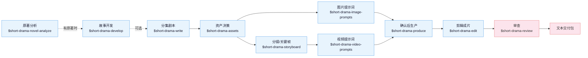

**中文** | [English](README_EN.md)

# Drama Skills

> 项目页：<https://zenstory.ai/drama-skills> · ZenStory AI 全部项目：<https://zenstory.ai/projects>

[](https://github.com/zenstory-ai/drama-skills/actions/workflows/ci.yml)
[](https://github.com/zenstory-ai/drama-skills/releases/latest)
[](https://www.python.org/)
[](LICENSE)

面向编剧、漫剧工作室和编导的 AI 短剧创作工作流。十一个技能把一个点子或一部长篇材料，
一路做成分集剧本、资产设定、图片提示词、分镜关键帧和视频提示词，
用清晰的所有权与连续性衔接。适配 Claude Code、Codex 和其他
支持 Agent Skill 规范的运行环境。

新项目每集默认只维护五份 Markdown：`剧本.md`、`视觉设定.md`、`分镜.md`、
`图片提示词.md` 和 `视频提示词.md`。

## 由来

这套技能来自我们自己的漫剧工作室产线：2025 年至今累计上千个 AI 短剧 / 漫剧项目，
中间换过几轮自建和开源工具。前后端加起来近 8 万行代码，在模型能力和需求的迭代速度
面前逐渐维护不动了。

后来干脆抛开自建的一体化图形工具，把历史项目工程和图片 / 视频提示词蒸馏成这套技能，
让制作人直接用 agent CLI 加文件维护工程、生成提示词，确认之后再送去生成——结果意外地顺手。
现在留在自建工具里的，只剩排队抽卡。

**刻意把确认放在生产之前**：提示词先落进文件，生产 skill 展示本次准确数量、内容、参考、
参数、输出和 adapter；用户看到预览并明确确认后才执行。供应商凭据不进入项目，
项目文件和其他 Skill 都不绑定供应商。

## 安装

需要 **Python 3.9 或更新版本**（macOS 自带的即可）。直接告诉 Claude Code、
Codex 等支持导入 GitHub 仓库的智能体：

```
安装这些技能 https://github.com/zenstory-ai/drama-skills
```

<details>
<summary>手动链接（可安装全部，也可只链接需要的技能）</summary>

```bash
git clone https://github.com/zenstory-ai/drama-skills.git && cd drama-skills

# Claude Code
mkdir -p "$HOME/.claude/skills"
for skill in skills/*; do
  ln -s "$PWD/$skill" "$HOME/.claude/skills/$(basename "$skill")"
done

# Codex
mkdir -p "${CODEX_HOME:-$HOME/.codex}/skills"
for skill in skills/*; do
  ln -s "$PWD/$skill" "${CODEX_HOME:-$HOME/.codex}/skills/$(basename "$skill")"
done
```

每个技能都是独立安装单元；只使用写作、审查或生产等单一能力时，可以只链接对应目录。
`short-drama` 提供项目初始化、路由与 Dashboard，但不是其他技能的安装门禁。

</details>

调用写法随运行环境而变：Claude Code 用 `/short-drama`，Codex 用 `$short-drama`，
也可以不写前缀、直接用自然语言说明要做什么。两种写法在下文示例中可以互换。

## 快速开始

```
# 0. 有原著时（可选）：先抽样快评，再决定要不要全量拆
用 $short-drama-novel-analyze 快评 输入/这本小说.txt，先告诉我值不值得拆

# 已有多集完整剧本时（可选）：按文件实际结构索引，每次只读当前集，断点续做分集地图
用 $short-drama-develop 从 输入/剧本完整版.txt 生成分集地图；先识别这份文件的分集方式，不要整稿塞进上下文

# 1. 新建项目
用 $short-drama 初始化一个都市打脸题材的短剧项目，竖屏 9:16

# 2. 写第一集
用 $short-drama-write 写第 1 集：外卖员在高档餐厅被经理羞辱，亮出集团董事身份

# 3. 拆资产，写提示词与分镜（可在同一请求内连续完成）
用 $short-drama-assets 从第 1 集拆人物/场景/道具
需要统一视觉语言时，可选用 $short-drama 做 Look Development
用 $short-drama-image-prompts 为已接受的资产写参考图提示词
用 $short-drama-storyboard 给第 1 集做正式分镜与冻结关键帧
用 $short-drama-video-prompts 把分镜逐镜翻译成视频提示词
# 指定目标视频模型、并且要人物/场景/道具跨镜一致时，把参考图的事也说清楚：
用 $short-drama-video-prompts 按 MiniMax H3 写第 1 集视频提示词；先在项目里找已有的角色图、场景图、道具图和本镜起始帧绑成参考，缺哪张就列出来，不要改成文生视频
# 参考图在自己的界面里出、不进项目时，让技能写出逐镜挂图计划，视频提示词照常产出：
用 $short-drama-video-prompts 按 MiniMax H3 写第 1 集视频提示词；参考图我自己挂，逐镜告诉我挂哪几张、什么顺序、每张管什么

# 4. 明确确认后投产
用 $short-drama-produce 预览第 1 集已接受的图片、视频、TTS 或时间线音乐任务；等我确认后再执行

# 5. 把生产出来的素材剪成成片
用 $short-drama-edit 把第 1 集已生产的镜头剪成成片，逐段写清入出点理由

# 6. 需要时再审查
用 $short-drama-review 审查第 1 集的剧本与提示词
```

示例都在 [examples/](examples/)。creator-first 的公开完整样例是
[《让你管账号》EP001](examples/creator-first/EP001/)；其余目录仅作为仓库维护和校验器回归夹具。
想把十一个技能按漫剧产线从头串一遍（每步命令、产物与卡点），看
[漫剧创作全流程指引](docs/comic-drama-workflow.md)。

## 十一个技能



| 技能 | 职责 |
|---|---|
| `short-drama` | 初始化、路由、视觉方向/Look Development 与 Dashboard |
| `short-drama-novel-analyze` | 长篇原著的抽样改编快评、章节索引、逐章功能提取、剧情单元与节奏、改编价值与分集候选 |
| `short-drama-develop` | 小说/长材料的可追溯改编、多集整稿的 Agent 主导切片与续跑、故事引擎、分集地图、导演阐述、题材与钩子手册 |
| `short-drama-write` | 单集目标、因果节拍、可拍剧本和项目选择的制作稿格式 |
| `short-drama-assets` | 人物/造型、地点/视图、道具/状态、可选的角色声音方向与连续性决策 |
| `short-drama-image-prompts` | Lookdev 风格帧、角色/场景/道具参考板提示词与定点修改说明 |
| `short-drama-storyboard` | 可选场次视觉计划与 Coverage Audition、原文落实、镜头、边界和冻结关键帧 |
| `short-drama-video-prompts` | 单镜动作、多人物表演与注意交接、摄影、声音、起止状态、补拍说明，以及跨镜时间线音乐规格 |
| `short-drama-produce` | 展示有边界的图片/视频/TTS/音乐任务，取得本次明确确认后通过外部 adapter 执行并记录结果；可选支持 Seedance、GPT Image 2、MiniMax H3 视频与 MiniMax Music |
| `short-drama-edit` | 逐镜素材的可用带、入出点取舍、镜序、台词完整性、字幕与响度，写成剪辑单并渲染成片 |
| `short-drama-review` | 结构/内容审查、授权生产观察的项目级校准诊断与修订结论 |

## 演示

下面这段 24 秒样片是一次完整实跑的末端产物：从一部 20 章的原著开始，经原著分析、剧本、
视觉设定、图片提示词、分镜（21 镜）、视频提示词，再逐镜生成 SC003 一场的八段素材，
按剪辑单剪成成片。

https://github.com/user-attachments/assets/0809876a-2a23-4723-a809-45c57988939f

## 本地短剧创作台

在智能体里一句话启动（Codex 写作 `$short-drama dashboard`）：

```
/short-drama dashboard
```

macOS、Linux、WSL 与 Windows 原生都可运行。创作台以 `--detach` 独立进程运行，链接在整个创作期间
保持有效；`--status` 打印当前链接，`--stop` 关闭。

全部跑完后导出交付：`$short-drama` 用 `project_tool.py export <project> --out <项目外目录>`
把每集现有的五份 Markdown 和 `制作成果/` 复制成一份带清单和校验和的交付目录。


## 致谢

[LINUX DO - The New Ideal Community](https://linux.do) — 社区支持

## ZenStory AI 项目

本项目由 [ZenStory AI](https://zenstory.ai) 维护——一组开源、面向 agent 的故事创作、改编与生产工具（GitHub 组织：[zenstory-ai](https://github.com/zenstory-ai)）。同组织项目：

| 项目 | 用途 |
| --- | --- |
| [oh-story-claudecode](https://github.com/zenstory-ai/oh-story-claudecode) | 网文写作 skill 包：扫榜、拆文、写作、去AI味、封面图 |
| [drama-skills](https://github.com/zenstory-ai/drama-skills) | AI 短剧 / 漫剧创作 skill 合集：剧本、资产、分镜、图片/视频提示词、独立审查（本仓库） |
| [novel-to-game](https://github.com/zenstory-ai/novel-to-game) | 把小说改编成可玩游戏的 agent skills |
| [video-recap-skills](https://github.com/zenstory-ai/video-recap-skills) | 把任意视频剪成中文解说视频，支持剪映草稿导出 |
| [oh-story-dsh](https://github.com/zenstory-ai/oh-story-dsh) | DeepSeek Harness 插件，封装 Oh Story 与 Drama Skills 工作流 |
| [zenstory](https://github.com/zenstory-ai/zenstory) | 对话即创作的 AI 小说写作工作台（[app.zenstory.ai](https://app.zenstory.ai)） |
