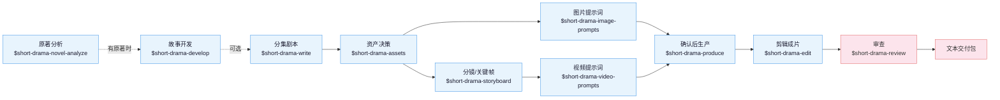

<p align="center">
  
</p>

<h1 align="center">Drama Skills</h1>

<p align="center">
  <b>面向编剧、漫剧工作室和编导的 AI 短剧创作工作流：十一个技能，从一个点子或一部原著做到分集剧本、分镜、图片/视频提示词和成片。</b>
</p>

<p align="center">
  <a href="https://zenstory.ai/zh/drama-skills"><b>项目主页</b></a>
  &nbsp;·&nbsp;
  <a href="#安装"><b>安装</b></a>
  &nbsp;·&nbsp;
  <a href="#看看它的输出"><b>看看它的输出</b></a>
  &nbsp;·&nbsp;
  <a href="README_EN.md"><b>English</b></a>
</p>

<p align="center">
  <a href="https://github.com/zenstory-ai/drama-skills/stargazers"></a>
  <a href="https://github.com/zenstory-ai/drama-skills/releases/latest"></a>
  
  <a href="https://www.python.org/"></a>
  <a href="https://github.com/zenstory-ai/drama-skills/actions/workflows/ci.yml"></a>
  <a href="./LICENSE"></a>
</p>

<video src="https://github.com/user-attachments/assets/96825043-cfed-4f0e-b53b-cf61919c9c0f" controls muted playsinline width="100%"></video>

上面这段 24 秒竖屏样片是一次完整实跑的最后一步：从一部 20 章的原著开始，经原著分析、剧本、视觉设定、
图片提示词、分镜（21 镜）、视频提示词，只为剧本第三场（SC003）逐镜生成八段素材，再按剪辑单剪成成片。

## 这是什么

Drama Skills 覆盖 AI 短剧 / 漫剧从点子或原著到成片的全流程：**原著分析 → 分集剧本 → 视觉设定 →
图片提示词与分镜 → 视频提示词 → 确认后生产 → 剪辑成片 → 审查**。
它以 11 个 skill 的形式装进你已经在用的编程 Agent（Claude Code、Codex 及其他支持 Agent Skill 规范的环境），
写作用的模型就是该 Agent 的模型。

- **五份 Markdown 就是创作事实** — 每集只维护 `剧本.md`、`视觉设定.md`、`分镜.md`、`图片提示词.md`、
  `视频提示词.md`，剪成片时多一份 `剪辑单.md`。没有并行的数据库，改哪份文件就是改哪一层决定。
- **人物和造型跨镜不走样，靠的是写进文件、脚本能核对的事实** — 需要跨镜保持的造型写成一条能原样贴进提示词的短语（连续性锁）；
  每一镜写完关键帧后要说明它依据了哪些条目；漏了的，检查脚本会指出来，真实报错见下文。
- **先预览、确认，再生产** — 任何图片、视频、配音或音乐任务，都先在文件里看到这一批准确的内容和参数，
  明确确认后才调用外部接口花钱。
- **成片也在套件里** — 剪辑技能逐段写下入点、出点为什么选在那里，字幕逐字取自剧本，统一响度后渲染；
  核对和测量脚本只回报事实，不下判断。

## 由来

这套技能来自我们自己的漫剧工作室产线：2025 年至今累计上千个 AI 短剧 / 漫剧项目，
中间换过几轮自建和开源工具。前后端加起来近 8 万行代码，在模型能力和需求的迭代速度
面前逐渐维护不动了。

后来干脆抛开自建的一体化图形工具，把历史项目工程和图片 / 视频提示词蒸馏成这套技能，
让制作人直接用 agent CLI 加文件维护工程、生成提示词，确认之后再送去生成——结果意外地顺手。
现在留在自建工具里的，只剩排队抽卡。

**刻意把确认放在生产之前**：提示词先落进文件，生产 skill 展示本次准确数量、内容、参考、
参数、输出和 adapter；用户看到预览并明确确认后才执行。供应商凭据不进入项目，
项目文件和其他 Skill 都不绑定供应商。

## 安装

前提：你已经在用 Claude Code、Codex 或其他支持 Agent Skill 规范的编程 Agent；下面这条命令需要终端里能运行 `npx`（Node.js）。

```bash
npx skills add zenstory-ai/drama-skills -y -g
```

`-g` 全局安装，所有目录可用；去掉 `-g` 则只装到当前目录。**更新时重新执行同一条命令即可。**
脚本需要 **Python 3.9 或更新版本**（macOS 自带的即可）；剪辑成片另需 `ffmpeg` / `ffprobe` 在 PATH 上。

也可以直接对 Agent 说一句话（支持导入 GitHub 仓库 / skill 的平台都适用）：

```
安装这些技能 https://github.com/zenstory-ai/drama-skills
```

<details>
<summary>手动链接（可安装全部，也可只链接需要的技能）</summary>

```bash
git clone https://github.com/zenstory-ai/drama-skills.git && cd drama-skills

# Claude Code
mkdir -p "$HOME/.claude/skills"
for skill in skills/*; do
  ln -s "$PWD/$skill" "$HOME/.claude/skills/$(basename "$skill")"
done

# Codex
mkdir -p "${CODEX_HOME:-$HOME/.codex}/skills"
for skill in skills/*; do
  ln -s "$PWD/$skill" "${CODEX_HOME:-$HOME/.codex}/skills/$(basename "$skill")"
done
```

每个技能都是独立安装单元；只用写作、审查或生产等单一能力时，只链接对应目录即可。
`short-drama` 提供项目初始化、路由与 Dashboard。

</details>

调用写法随运行环境而变：Claude Code 用 `/short-drama`，Codex 用 `$short-drama`，
也可以不写前缀、直接用自然语言说明要做什么。两种写法在下文示例中可以互换。

> 变更见 [CHANGELOG.md](CHANGELOG.md) 与 [Releases](https://github.com/zenstory-ai/drama-skills/releases)；
> 升级既有项目要做什么，见常见问题[「升级到新版本后要做什么」](#升级到新版本后要做什么)。

## 快速开始

下面的请求复制改一改就能用：

```
# 0. 有原著时（可选）：先抽样快评，再决定要不要全量拆
用 $short-drama-novel-analyze 快评 输入/这本小说.txt，先告诉我值不值得拆

# 已有多集完整剧本时（可选）：按文件实际结构索引，每次只读当前集，断点续做分集地图
用 $short-drama-develop 从 输入/剧本完整版.txt 生成分集地图；先识别这份文件的分集方式，不要整稿塞进上下文

# 1. 新建项目
用 $short-drama 初始化一个都市打脸题材的短剧项目，竖屏 9:16

# 2. 写第一集
用 $short-drama-write 写第 1 集：外卖员在高档餐厅被经理羞辱，亮出集团董事身份

# 3. 拆资产，写提示词与分镜（可在同一请求内连续完成）
用 $short-drama-assets 从第 1 集拆人物/场景/道具
需要统一视觉语言时，可选用 $short-drama 做 Look Development
用 $short-drama-image-prompts 为已接受的资产写参考图提示词
用 $short-drama-storyboard 给第 1 集做正式分镜与冻结关键帧
用 $short-drama-video-prompts 把分镜逐镜翻译成视频提示词
# 指定目标视频模型、并且要人物/场景/道具跨镜一致时，把参考图的事也说清楚：
用 $short-drama-video-prompts 按 MiniMax H3 写第 1 集视频提示词；先在项目里找已有的角色图、场景图、道具图和本镜起始帧绑成参考，缺哪张就列出来，不要改成文生视频
# 参考图在自己的界面里出、不进项目时，让技能写出逐镜挂图计划，视频提示词照常产出：
用 $short-drama-video-prompts 按 MiniMax H3 写第 1 集视频提示词；参考图我自己挂，逐镜告诉我挂哪几张、什么顺序、每张管什么

# 4. 明确确认后投产
用 $short-drama-produce 预览第 1 集已接受的图片、视频、TTS 或时间线音乐任务；等我确认后再执行

# 5. 把生产出来的素材剪成成片
用 $short-drama-edit 把第 1 集已生产的镜头剪成成片，逐段写清入出点理由

# 6. 需要时再审查
用 $short-drama-review 审查第 1 集的剧本与提示词
```

从原著出发、第一轮只要文本交接的写法：

> 用我拥有或获准改编的 `输入/故事.txt`，先列出必须保留的事实、人物动机与暂不可揭示的信息，再提出分集方案；章节数不要直接当集数。只写第一集，并交接其中三个镜头的起止动作、双手、持物和视线。区分 `IMG-*`、待提供的 `PLAN-*` 与已实际检查的 `REF-*`，止步于文本，不生成图片、视频、配音或音乐。

## 看看它的输出

下面三段节选都来自仓库里的文件或一次真实运行，省略处以「……」标出。完整版（原著快评的回填对照、改编契约、
剪辑实测与模型行为观察）在[真实产出节选](docs/real-outputs.md)。

### 一集写出来是什么样

公开样例 [《让你管账号》EP001](examples/creator-first/EP001/) 里，同一个镜头在四份文档里各管一层。剧本只写发生了什么：

```markdown
桌对面，周薄森把一摞材料推过厚玻璃桌面。纸角碰到江晨指尖。
……
周薄森端起缺口搪瓷茶缸，抿一口冷茶，眉头皱得更深。
```

`视觉设定.md` 给需要跨镜保持的造型上「连续性锁」，锁面是一条能原样贴进提示词的短语：

```markdown
- 连续性锁：LOCK-JIANGCHEN-DRESS《江晨橄榄绿立领常服》（镜头：SHOT-EP001-002、SHOT-EP001-003、SHOT-EP001-007；
  图片提示词项：IMG-JIANGCHEN-SHEET）· 锁面：olive-green stand-collar service dress
```

`分镜.md` 写这一镜的起点和终点，冻结关键帧只画起点那一格，锁面原样出现在里面：

```markdown
## SHOT-EP001-002 · 把空白交到他手里
- 起点：材料在周薄森手下，茶缸停在旧茶渍旁。
- 终点：纸角抵住江晨指尖；周薄森说出“基本还是空白”。

### 冻结关键帧提示词
> 9:16 vertical two-person medium shot inside an old regiment office, Zhoubosen, a broad square-faced middle-aged officer on
> frame right rests one hand on a stack of papers ……, Jiangchen, a lean young man in olive-green stand-collar service dress,
> seen three-quarter from behind on frame left ……; chipped white enamel mug beside an old tea ring, …… no text, no logo.
```

`视频提示词.md` 只写起点到终点之间模型要执行的动作，整段复制进生成界面就能用：

```markdown
## MOTION-EP001-002 · 把空白交到他手里
### 可复制提示词
> …… The middle-aged officer pushes the paper stack about twenty centimeters across the glass desk while speaking calmly.
> The young man does not reach for it until the paper touches his fingertip. The officer then lifts the chipped white enamel
> mug for one small sip, frowns at the cold tea, and returns it exactly to the old tea ring. ……
```

四份原文：[`剧本.md`](examples/creator-first/EP001/剧本.md) ·
[`视觉设定.md`](examples/creator-first/EP001/视觉设定.md) ·
[`分镜.md`](examples/creator-first/EP001/分镜.md) ·
[`视频提示词.md`](examples/creator-first/EP001/视频提示词.md)。

### 写漏了会被指出来

`creator_markdown_check.py` 核对五份文档之间的引用。把样例故意改坏两处——删掉 SHOT-002 视觉依据里的周薄森、
把 MOTION-003 的时长从 5s 改成 4s——它报的是原因，不是「校验失败」：

```text
ERROR: SHOT-EP001-002: 冻结关键帧提示词写到人物「周薄森」，视觉依据没有覆盖；本镜确实看不见时在视觉依据末尾加「；画外：人物「周薄森」」，正文里这个名字不可靠时在《视觉设定.md》写「画面代称：无」
ERROR: SHOT-EP001-003: 分镜时长 5 秒与视频提示词 4 秒不一致；视频提示词只能原样照抄已接受的镜头时长
```

### 样片是怎么剪出来的

文首样片按 `剪辑单.md` 剪成：每一刀写画面上发生了什么，字幕逐字取自剧本，时间来自对素材的实测。最后一段：

```markdown
## CUT-EP001-008 · 诸君，且听龙吟
- 来源：MOTION-EP001-017 · 制作成果/video/MOTION-EP001-017.mp4
- 入点：2.00
- 出点：7.00
- 时长：5.00
- 取舍：入点=开头 1.5 秒的凝视与上一段发布前的蓄势重复，整段去掉，从身体前倾进；出点=实测句尾收音在源 6.82 秒，
  出点留到 7.00 秒，身体后靠的姿态变化已完成（素材总长 7.29 秒，可用余量只有 0.29 秒）
- 字幕：诸君，且听龙吟
```

完整[剪辑单](https://github.com/zenstory-ai/drama-skills/blob/004d945d452f4eb607c5820f437218217af60f6e/evaluations/%E8%AE%A9%E4%BD%A0%E7%AE%A1%E8%B4%A6%E5%8F%B7/reference-run-0.6.6/%E5%89%A7%E9%9B%86/EP001/%E5%89%AA%E8%BE%91%E5%8D%95.md)与 [21 镜分镜](https://github.com/zenstory-ai/drama-skills/blob/004d945d452f4eb607c5820f437218217af60f6e/evaluations/%E8%AE%A9%E4%BD%A0%E7%AE%A1%E8%B4%A6%E5%8F%B7/reference-run-0.6.6/%E5%89%A7%E9%9B%86/EP001/%E5%88%86%E9%95%9C.md)在提交 `004d945` 里。

## 十一个技能



| 技能 | 职责 |
|---|---|
| `short-drama` | 初始化、路由、视觉方向/Look Development 与 Dashboard |
| `short-drama-novel-analyze` | 长篇原著的抽样改编快评、章节索引、逐章功能提取、剧情单元与节奏、改编价值与分集候选 |
| `short-drama-develop` | 小说/长材料的可追溯改编、多集整稿的 Agent 主导切片与续跑、故事引擎、分集地图、导演阐述、题材与钩子手册 |
| `short-drama-write` | 单集目标、因果节拍、可拍剧本和项目选择的制作稿格式 |
| `short-drama-assets` | 人物/造型、地点/视图、道具/状态、可选的角色声音方向与连续性决策 |
| `short-drama-image-prompts` | Lookdev 风格帧、角色/场景/道具参考板提示词与定点修改说明 |
| `short-drama-storyboard` | 可选场次视觉计划与 Coverage Audition、原文落实、镜头、边界和冻结关键帧 |
| `short-drama-video-prompts` | 单镜动作、多人物表演与注意交接、摄影、声音、起止状态、补拍说明，以及跨镜时间线音乐规格 |
| `short-drama-produce` | 展示有边界的图片/视频/TTS/音乐任务，取得本次明确确认后通过外部 adapter 执行并记录结果；可选支持 Seedance、GPT Image 2、MiniMax H3 视频与 MiniMax Music |
| `short-drama-edit` | 逐镜素材的可用带、入出点取舍、镜序、台词完整性、字幕与响度，写成剪辑单并渲染成片 |
| `short-drama-review` | 结构/内容审查、授权生产观察的项目级校准诊断与修订结论 |

## 本地短剧创作台

在智能体里一句话启动（Codex 写作 `$short-drama dashboard`）：

```
/short-drama dashboard
```


macOS、Linux、WSL 与 Windows 原生都可运行。创作台以 `--detach` 独立进程运行，链接在整个创作期间
保持有效；`--status` 打印当前链接，`--stop` 关闭。服务只监听本机，项目内容不上传。

全部跑完后导出交付：`$short-drama` 用 `project_tool.py export <project> --out <项目外目录>`
把每集现有的五份 Markdown 和 `制作成果/` 复制成一份带清单和校验和的交付目录。

## 常见问题

### MiniMax H3 的提示词有六段，全部复制还是只复制第一段？

全部复制。六段属于**同一条正文、一次提交**：`retention_analysis` 引用的 `<Subject N>` 在 `subject_definitions` 里定义，
`<Picture N>` 按本镜「输入参考图」的顺序编号，拆开提交后面几段就没有指代对象了。从 `### 可复制提示词` 下第一行到最后一行
整段贴进那一次生成，下一镜换它自己那条。见[五份创作文档](skills/short-drama/references/creator-documents.md)与
[MiniMax H3 方言](skills/short-drama-video-prompts/references/minimax-h3.md)。

### 参考图我在自己的界面里出、不想放进项目，还能拿到图生视频提示词吗？

能。让分镜把这一镜要挂的图写成 `PLAN-*` 槽位（定位符是 `IMG-*` 板子或本镜 `SHOT-*` 冻结关键帧，`顺序` 就是挂图次序，
每张写用途），视频提示词照常按图生视频产出，并逐镜列出挂哪几张、什么顺序、每张管什么；只有让套件实际调用接口生成时才需要真实文件。
`REF-*` 留给项目里确实存在并检查过的图片。

### 指定了目标视频模型，为什么收到的是文生视频提示词？

点名模型不等于选择文生视频。先把模型写进 `short-drama.json` 的 `production_profile`，再让分镜按可见人物、地点、道具和起始帧
去项目里找已有的图绑成带用途的 `REF-*`；仍缺图就列表停下，不改成文生视频。见
[漫剧创作全流程指引 · 常见卡点](docs/comic-drama-workflow.md#常见卡点)。

### H3 视频里对白赶读或被截断怎么办？

分镜阶段先估对白时长再定镜长：H3 中文小样本约 4.1 个可发声字/秒，较密的输入会赶词或静默截断。分镜把估时依据写在本镜「声音」里，
放不下就延长镜头或拆镜；视频提示词只能原样照抄已接受的时长。见[对白估时](skills/short-drama-storyboard/references/shot-craft.md#对白估时)。

### 说话的是 A，口型却落在画里 B 的脸上？

声音没选错，错的是口型落到画里最显眼的正脸。说话人第一次出现时在 `<d>` 外交代画内画外与音色，台词紧跟他的动作句；
台词期间画里还有别的正脸时，把那个人明写成闭嘴不说话，分镜能安排时先让他出画或背身。见
[MiniMax H3 方言 · 说话人绑定](skills/short-drama-video-prompts/references/minimax-h3.md#说话人绑定)；样本小，生成后仍核对。

### 视频任务提交后进程断了，要重投吗？

不要。任务在提交那一刻就已计费，内置 adapter 拿到供应商任务 ID 就落盘。中断后跑 `audit`，它把这次尝试报成 `orphaned_provider_job`；
再用 `collect --job-id <id>` 取回结果，取回不花钱、不走确认闸门。只有 `collect` 也确认那边确实失败，才重新确认与重投。见
[确认后生产](skills/short-drama-produce/SKILL.md)。

### 需要 GPU 或自己部署模型吗？生成媒体的钱从哪出？

不需要 GPU。写作、分镜和提示词由你正在用的编程 Agent 的模型完成，本地只跑确定性的检查脚本。生成媒体走 `$short-drama-produce`
的外部 adapter，用你在项目外配置的供应商凭据、按供应商计费，每个任务预览并明确确认后才执行。剪辑成片需要本机有 `ffmpeg` / `ffprobe`。

### 能在 Codex 里用吗？Windows 能用吗？

能。Claude Code 用 `/short-drama`，Codex 用 `$short-drama`，其他支持 Agent Skill 规范的环境按各自写法调用。
创作台在 macOS、Linux、WSL 与 Windows 原生都能跑；CI 在 Windows 上单独回归安装、分集导入与创作台。

### 静态漫剧（关键帧切换 + 配音）也要写视频提示词吗？

不用。分镜关键帧与图片提示词直接进入生产预览，跳过视频提示词那一层。见[漫剧创作全流程指引](docs/comic-drama-workflow.md)。

### 升级到新版本后要做什么？

重跑同一条安装命令；既有项目对每集跑一次 `creator_markdown_check.py`，收紧过的规则会在这里报出来（例如 v0.7.0 起，
分镜「来源」引文点到的人物或道具没进视觉依据、也没声明画外会报错，视频提示词与分镜时长不一致会报错），文档规则的改法见
[CHANGELOG.md](CHANGELOG.md) 里的《升级》段。剪过片的再跑一次 `edit_tool.py check`：v0.7.1 起「未采用镜头」要逐个写镜号和理由，
「001 至 009」这种范围写法不再被接受。

## 延伸阅读

- 示例：[examples/](examples/)，公开完整样例是 [《让你管账号》EP001](examples/creator-first/EP001/)；其余目录是仓库校验器的回归夹具。
- [真实产出节选](docs/real-outputs.md)：一镜穿过四份文档、检查器报错、剪辑单与实测、原著快评回填、改编契约、模型行为观察。
- [评估](evaluations/README.md)：按文档实跑一次的完整产物、发布前的回归闸门与主工作流实跑方法。
- [漫剧创作全流程指引](docs/comic-drama-workflow.md)：把十一个技能按漫剧产线从头串一遍，每步命令、产物与卡点。
- [跨镜一致性怎么做](docs/character-consistency-across-shots.md)：跨镜、跨集角色一致性，三视图之外的三层文件事实。
- [小说改短剧指南](https://zenstory.ai/zh/drama-skills/novel-to-short-drama)：从有权改编的原著出发，形成分集决策、单集剧本与小范围分镜交接。
- [角色跨镜一致性指南](https://zenstory.ai/zh/drama-skills/character-consistency)：分开人物身份、本场造型与逐镜变化的双手、持物、视线；区分 `IMG-*`、`PLAN-*` 与 `REF-*`。
- [An open-source AI short-drama pipeline](docs/open-source-short-drama-pipeline.md)：英文读者的分阶段说明。

## 贡献

欢迎提交 Bug、输出质量 Case 与功能请求到 [Issues](https://github.com/zenstory-ai/drama-skills/issues/new/choose)，请按结构化表单附上复现材料或具体输出。修改原则与必跑测试见 [CONTRIBUTING.md](CONTRIBUTING.md)。

<a href="https://github.com/zenstory-ai/drama-skills/graphs/contributors"></a>

## 致谢

[LINUX DO - The New Ideal Community](https://linux.do) — 社区支持

## ZenStory AI 项目

本项目由 [ZenStory AI](https://zenstory.ai/zh) 维护——一组开源、面向 agent 的故事创作、改编与生产工具（GitHub 组织：[zenstory-ai](https://github.com/zenstory-ai)）。同组织项目：

| 项目 | 用途 |
| --- | --- |
| [oh-story-claudecode](https://github.com/zenstory-ai/oh-story-claudecode) | 网文写作 skill 包：扫榜、拆文、写作、去AI味、封面图 |
| [drama-skills](https://github.com/zenstory-ai/drama-skills) | AI 短剧 / 漫剧创作 skill 合集：剧本、资产、分镜、图片/视频提示词、独立审查（本仓库） |
| [novel-to-game](https://github.com/zenstory-ai/novel-to-game) | 面向原著改编、指定运行环境构建与运行证据 QA 的 agent skills |
| [video-recap-skills](https://github.com/zenstory-ai/video-recap-skills) | 将支持的视频文件制作成中文解说，可选导出可编辑的剪映/CapCut 草稿 |
| [oh-story-dsh](https://github.com/zenstory-ai/oh-story-dsh) | DeepSeek Harness 社区插件，提供小说、短剧、游戏和视频解说工作台 |
| [zenstory](https://github.com/zenstory-ai/zenstory) | 对话即创作的 AI 小说写作工作台（[app.zenstory.ai](https://app.zenstory.ai)） |
