<!-- Last synced with README.md: 2026-09-18 -->

<p align="center">
  
</p>

<h1 align="center">Drama Skills</h1>

<p align="center">
  <b>An AI short-drama creation workflow for screenwriters, motion-comic studios, and directors: eleven skills that take an idea or a source novel to episode scripts, storyboards, image/video prompts, and a finished cut.</b>
</p>

<p align="center">
  <a href="https://zenstory.ai/drama-skills"><b>Project page</b></a>
  &nbsp;·&nbsp;
  <a href="#install"><b>Install</b></a>
  &nbsp;·&nbsp;
  <a href="#see-what-it-produces"><b>See what it produces</b></a>
  &nbsp;·&nbsp;
  <a href="README.md"><b>中文</b></a>
</p>

<p align="center">
  <a href="https://github.com/zenstory-ai/drama-skills/stargazers"></a>
  <a href="https://github.com/zenstory-ai/drama-skills/releases/latest"></a>
  
  <a href="https://www.python.org/"></a>
  <a href="https://github.com/zenstory-ai/drama-skills/actions/workflows/ci.yml"></a>
  <a href="./LICENSE"></a>
</p>

<video src="https://github.com/user-attachments/assets/96825043-cfed-4f0e-b53b-cf61919c9c0f" controls muted playsinline width="100%"></video>

The 24-second portrait sample above is the last step of one complete run: a 20-chapter source novel went through
analysis, screenplay, visual design, image prompts, a 21-shot storyboard and video prompts; eight clips were
generated for the script's third scene (SC003) only and cut into a film against a cut list.

## What it is

Drama Skills covers the whole AI short-drama / motion-comic pipeline from idea or novel to a finished cut:
**source analysis → episode script → visual design → image prompts and storyboard → video prompts →
confirmed production → editing → review**.
It installs as 11 skills into the coding agent you already use (Claude Code, Codex, and any other runtime
that supports the Agent Skill spec); the writing model is that agent's model.

- **Five Markdown files are the creative facts** — each episode maintains only `剧本.md` (script),
  `视觉设定.md` (visual design), `分镜.md` (storyboard), `图片提示词.md` (image prompts) and
  `视频提示词.md` (video prompts), plus `剪辑单.md` (cut list) when you cut a film. There is no parallel
  database; editing a file is editing that layer of decisions.
- **Characters and looks hold across shots because the facts are in files a script can check** — a look that must
  hold across shots is written as one phrase (a continuity lock) that is pasted into every affected prompt unchanged;
  every shot, once its keyframe is written, states which entries it relies on; whatever is missing, the check script
  points out. Real error output is shown below.
- **Preview, confirm, then produce** — every image, video, voice or music job is shown in a file first, with the
  exact content and parameters of this batch; an external API is called, and money spent, only after you explicitly
  confirm.
- **The cut is part of the suite** — the editing skill writes down why each in and out point sits where it does,
  takes subtitles verbatim from the script, normalises loudness and renders; the check and measurement scripts
  report facts only and pass no verdict.

## Where this came from

These skills come out of our own motion-comic studio's production line: over a
thousand AI short-drama and motion-comic projects since 2025, across several
generations of in-house and open-source tooling. Front end and back end together
reached nearly 80,000 lines, and stopped being maintainable at the pace models and
requirements were moving.

The answer turned out to be dropping the monolithic all-in-one GUI — distilling
the historical project workspaces and image/video prompts into this skill suite, and letting
producers maintain projects and write prompts directly through an agent CLI over
plain files, confirming the prompts before anything goes to generation. It works
noticeably better. What is left of the in-house tooling is the generation queue.

**Confirmation deliberately comes before production:** prompts land in files first.
The production skill shows the exact count, content, references, parameters, outputs,
and adapter; it executes only after the user sees and confirms that preview.
Credentials stay outside the project, and project files and the other skills remain
provider-neutral.

## Install

Prerequisite: you already use Claude Code, Codex or another coding agent that supports the Agent Skill spec; the
command below needs `npx` (Node.js) in your terminal.

```bash
npx skills add zenstory-ai/drama-skills -y -g
```

`-g` installs globally for every directory; drop it to install into the current directory only.
**To update, run the same command again.** The scripts need **Python 3.9 or newer** (the version macOS ships
is enough); cutting a film additionally needs `ffmpeg` / `ffprobe` on PATH.

You can also just tell your agent (any platform that can import a GitHub repository or skill):

```
Install this skill suite: https://github.com/zenstory-ai/drama-skills
```

<details>
<summary>Manual linking (install all skills or only the ones you need)</summary>

```bash
git clone https://github.com/zenstory-ai/drama-skills.git && cd drama-skills

# Claude Code
mkdir -p "$HOME/.claude/skills"
for skill in skills/*; do
  ln -s "$PWD/$skill" "$HOME/.claude/skills/$(basename "$skill")"
done

# Codex
mkdir -p "${CODEX_HOME:-$HOME/.codex}/skills"
for skill in skills/*; do
  ln -s "$PWD/$skill" "${CODEX_HOME:-$HOME/.codex}/skills/$(basename "$skill")"
done
```

Each skill is an independent installation unit. For a single writing, review, or
production capability, link only that directory. `short-drama` provides project
initialization, routing, and the Dashboard.

</details>

Invocation differs by runtime: Claude Code uses `/short-drama`, Codex uses
`$short-drama`, and you can always drop the prefix and just describe the task in
plain language. The two forms are interchangeable in the examples below.

> Changes are in [CHANGELOG.md](CHANGELOG.md) and [Releases](https://github.com/zenstory-ai/drama-skills/releases);
> what to do when upgrading an existing project is in the FAQ entry [What do I do after upgrading?](#what-do-i-do-after-upgrading).

## Quick start

Copy any of these requests, tweak the details, and send:

```
# 0. With a source novel (optional): triage before committing to a full pass
Use $short-drama-novel-analyze to triage 输入/novel.txt and tell me whether it is worth adapting

# With a complete multi-episode script (optional): infer this file's boundaries,
# read one episode at a time, and resume the episode map from disk
Use $short-drama-develop to build the episode map from 输入/full-screenplay.txt without loading the whole season into context

# 1. New project
Use $short-drama to init a vertical 9:16 urban face-slapping short-drama project

# 2. Write episode 1
Use $short-drama-write to write EP001: a delivery rider humiliated by the manager at a luxury restaurant reveals he is a director of the group

# 3. Extract assets, write prompts and storyboards (these can be one request)
Use $short-drama-assets to extract characters/scenes/props from EP001
When the visual language needs alignment, optionally use $short-drama for Look Development
Use $short-drama-image-prompts to write reference prompts for accepted assets
Use $short-drama-storyboard to author EP001's storyboard and frozen keyframes
Use $short-drama-video-prompts to translate each authored shot into a video prompt
# When you name a target model and need people/places/props consistent across shots, say so about references too:
Use $short-drama-video-prompts to write EP001's video prompts for MiniMax H3; first look through the project for existing character, location and prop images plus this shot's start frame and bind them as references, list whatever is still missing, and do not fall back to text-to-video
# When you make the reference images yourself and they never enter the project, ask for the attach plan instead:
Use $short-drama-video-prompts to write EP001's video prompts for MiniMax H3; I attach the reference images myself, so tell me per shot which pictures to attach, in what order, and what each one governs

# 4. Produce after explicit confirmation
Use $short-drama-produce to preview EP001's accepted image, video, TTS, or timeline-music job; execute only after I confirm

# 5. Cut the generated material into a film
Use $short-drama-edit to cut EP001's produced shots into a film, stating the reason behind every in and out point

# 6. Review when needed
Use $short-drama-review to review EP001's script and prompts
```

Starting from a source novel, with the first pass stopping at a text handoff:

> Use `输入/story.txt`, which I own or am authorized to adapt. First list the facts, character motivations, and unrevealed information that must be preserved, then propose the episode split; do not treat chapter count as episode count. Write only EP001 and hand off three of its shots with start/end action, both hands, held props, and gaze. Distinguish `IMG-*`, pending `PLAN-*`, and actually inspected `REF-*`; stop at text and do not generate images, video, voices, or music.

## See what it produces

The three excerpts below come from files in this repository or from one real run; cuts are marked with "…". The full
version (the source triage checked against its full pass, the adaptation contract, the measured cut, and the model
observations) is in [Excerpts of real output](docs/real-outputs_EN.md).

### What an episode looks like

In the public sample [*Let You Run the Account*, EP001](examples/creator-first/EP001/), the same shot is owned one layer at a
time across four documents. The script only says what happens (translated):

```markdown
Across the desk, Zhou Bosen pushes a stack of papers over the thick glass top. A corner touches Jiang Chen's fingertip.
…
Zhou Bosen lifts the chipped enamel mug, takes a sip of cold tea, and frowns harder.
```

`视觉设定.md` (visual design) gives a look that must hold across shots a **continuity lock**, whose lock phrase can be
pasted into a prompt unchanged (translated):

```markdown
- Continuity lock: LOCK-JIANGCHEN-DRESS "Jiang Chen's olive-green stand-collar service dress" (shots: SHOT-EP001-002, SHOT-EP001-003, SHOT-EP001-007;
  image prompt entry: IMG-JIANGCHEN-SHEET) · lock phrase: olive-green stand-collar service dress
```

`分镜.md` (storyboard) writes this shot's start and end; the frozen keyframe draws the start frame alone, with the lock
phrase inside it (translated; the prompt is quoted as written):

```markdown
## SHOT-EP001-002 · Handing him the blank
- Start: the papers are under Zhou Bosen's hand; the mug rests beside the old tea ring.
- End: the corner of the papers touches Jiang Chen's fingertip; Zhou Bosen says "basically still blank".

### Frozen keyframe prompt
> 9:16 vertical two-person medium shot inside an old regiment office, Zhoubosen, a broad square-faced middle-aged officer on
> frame right rests one hand on a stack of papers …, Jiangchen, a lean young man in olive-green stand-collar service dress,
> seen three-quarter from behind on frame left …; chipped white enamel mug beside an old tea ring, … no text, no logo.
```

`视频提示词.md` (video prompts) writes only the actions the model performs between start and end, ready to paste into the
generation tool as one block:

```markdown
## MOTION-EP001-002 · Handing him the blank
### Copyable prompt
> … The middle-aged officer pushes the paper stack about twenty centimeters across the glass desk while speaking calmly.
> The young man does not reach for it until the paper touches his fingertip. The officer then lifts the chipped white enamel
> mug for one small sip, frowns at the cold tea, and returns it exactly to the old tea ring. …
```

The four originals: [`剧本.md`](examples/creator-first/EP001/剧本.md) ·
[`视觉设定.md`](examples/creator-first/EP001/视觉设定.md) ·
[`分镜.md`](examples/creator-first/EP001/分镜.md) ·
[`视频提示词.md`](examples/creator-first/EP001/视频提示词.md).

### Omissions get pointed out

`creator_markdown_check.py` checks the references between the five documents. Break the sample in two places on purpose,
removing Zhou Bosen from SHOT-002's visual basis and changing MOTION-003's duration from 5s to 4s, and it reports the cause,
not "validation failed":

```text
ERROR: SHOT-EP001-002: 冻结关键帧提示词写到人物「周薄森」，视觉依据没有覆盖；本镜确实看不见时在视觉依据末尾加「；画外：人物「周薄森」」，正文里这个名字不可靠时在《视觉设定.md》写「画面代称：无」
ERROR: SHOT-EP001-003: 分镜时长 5 秒与视频提示词 4 秒不一致；视频提示词只能原样照抄已接受的镜头时长
```

The first line: the frozen keyframe names the character "Zhou Bosen" but the visual basis does not cover him; if he is
genuinely not visible, declare him off-screen. The second: the storyboard says 5 seconds and the video prompt says 4.

### How the sample was cut

The sample film at the top was cut against `剪辑单.md` (the cut list): every cut states what happens on screen, subtitles are
taken verbatim from the script, and timings come from measuring the clip. Its last entry (translated):

```markdown
## CUT-EP001-008 · Gentlemen, hear the dragon roar
- Source: MOTION-EP001-017 · 制作成果/video/MOTION-EP001-017.mp4
- In: 2.00
- Out: 7.00
- Duration: 5.00
- Choice: in = the first 1.5 s of staring repeats the wind-up before publishing in the previous cut, dropped entirely, enter on the lean
  forward; out = the measured end of the line is at 6.82 s in the source, hold to 7.00 s, the settle back into the chair is complete
  (clip length 7.29 s, only 0.29 s of margin)
- Subtitle: 诸君，且听龙吟 ("Gentlemen, hear the dragon roar", verbatim from the script)
```

The full [cut list](https://github.com/zenstory-ai/drama-skills/blob/004d945d452f4eb607c5820f437218217af60f6e/evaluations/%E8%AE%A9%E4%BD%A0%E7%AE%A1%E8%B4%A6%E5%8F%B7/reference-run-0.6.6/%E5%89%A7%E9%9B%86/EP001/%E5%89%AA%E8%BE%91%E5%8D%95.md) and [21-shot storyboard](https://github.com/zenstory-ai/drama-skills/blob/004d945d452f4eb607c5820f437218217af60f6e/evaluations/%E8%AE%A9%E4%BD%A0%E7%AE%A1%E8%B4%A6%E5%8F%B7/reference-run-0.6.6/%E5%89%A7%E9%9B%86/EP001/%E5%88%86%E9%95%9C.md) are at commit `004d945`.

## The eleven skills

```mermaid
flowchart LR
    classDef phase fill:#e8f4fd,color:#1a1a2e,stroke:#4a9be8,stroke-width:1px
    classDef final fill:#fce4ec,color:#333,stroke:#e57373,stroke-width:1px

    nva["Source analysis<br/>$short-drama-novel-analyze"]:::phase
    dev["Story development<br/>$short-drama-develop"]:::phase
    write["Episode script<br/>$short-drama-write"]:::phase
    assets["Asset decisions<br/>$short-drama-assets"]:::phase
    img["Image prompts<br/>$short-drama-image-prompts"]:::phase
    sb["Storyboard/keyframes<br/>$short-drama-storyboard"]:::phase
    vid["Video prompts<br/>$short-drama-video-prompts"]:::phase
    prod["Confirmed production<br/>$short-drama-produce"]:::phase
    cut["Editing<br/>$short-drama-edit"]:::phase
    rev["Review<br/>$short-drama-review"]:::final
    pkg["Text delivery package"]:::final

    nva -.with a source.-> dev
    dev -.optional.-> write --> assets
    assets --> img
    assets --> sb --> vid
    img --> prod
    vid --> prod
    prod --> cut --> rev --> pkg
```



| Skill | Responsibility |
|---|---|
| `short-drama` | Init, routing, visual direction/Look Development, and Dashboard |
| `short-drama-novel-analyze` | Sampled adaptation triage, chapter index, per-chapter function extraction, story units and rhythm, adaptation value, and episode candidates for a long source |
| `short-drama-develop` | Traceable adaptation, Agent-led indexing/slicing/resume for complete multi-episode scripts, story engine, episode map, director brief, genre & hook playbook |
| `short-drama-write` | Episode contract, causal beats, performable screenplay, and the project's accepted production dialect |
| `short-drama-assets` | Character/Look, Location/View, Prop/State, optional voice direction, continuity decisions |
| `short-drama-image-prompts` | Lookdev style frames, reusable character/location/prop reference prompts, and scoped edits |
| `short-drama-storyboard` | Optional scene visual plans and Coverage Auditions, source coverage, shots, boundaries, and frozen keyframes |
| `short-drama-video-prompts` | Single-shot action, multi-actor performance and attention handoffs, camera, sound, start/end states, reshoot notes, and cross-shot timeline-music specs |
| `short-drama-produce` | Preview a bounded image/video/TTS/music job, require explicit confirmation, execute an external adapter, and record results; optional Seedance, GPT Image 2, MiniMax H3 video, and MiniMax Music profiles are included |
| `short-drama-edit` | Usable band per generated clip, in/out points and shot order, dialogue integrity, subtitles and loudness; written as a cut list and rendered into a film |
| `short-drama-review` | Structural/content review, project-bounded diagnosis from authorized production observations, and revision verdicts |

## Local creator workspace

One line inside your agent (Codex writes `$short-drama dashboard`):

```
/short-drama dashboard
```


Runs on macOS, Linux, WSL, and native Windows. It serves with `--detach`, in its own process, so
the link stays valid for the whole session; `--status` reprints it and `--stop` shuts it down. It listens on the
local machine only; project content is not uploaded.

When everything is written, hand it over: `project_tool.py export <project> --out <dir outside the
project>` copies each episode's existing five Markdown documents and `制作成果/` into one delivery
directory with a manifest and checksums.

## FAQ

### The MiniMax H3 prompt has six paragraphs. Paste all of them, or only the first?

All of them. The six paragraphs are **one prompt body, submitted once**: the `<Subject N>` that `retention_analysis`
refers to are defined in `subject_definitions`, and `<Picture N>` is numbered by the order of this shot's input
references, so the later paragraphs have nothing to point at if submitted separately. Paste everything from the first
line under `### 可复制提示词` to the last into that one generation; the next shot gets its own complete body. See
[the five creator documents](skills/short-drama/references/creator-documents.md) and the
[MiniMax H3 dialect](skills/short-drama-video-prompts/references/minimax-h3.md) (Chinese).

### I make reference images in my own tool and don't want them in the project. Can I still get image-to-video prompts?

Yes. Have the storyboard write the pictures this shot needs as `PLAN-*` slots (located by an `IMG-*` board or this
shot's `SHOT-*` frozen keyframe; `order` is the attach order and every picture states its purpose). Video prompts are
produced as image-to-video as usual and list, per shot, which pictures to attach, in what order, and what each one
governs; real files are only needed when the suite itself calls a provider. `REF-*` is reserved for images that really
exist in the project and have been checked.

### I named a target video model, so why did I get text-to-video prompts?

Naming a model is not choosing text-to-video. First the model goes into `production_profile` in `short-drama.json`;
then the storyboard looks through the project for existing images of the visible characters, locations, props and
start frame and binds them as `REF-*` with a purpose. If pictures are still missing it lists them and stops rather than
falling back to text-to-video. See
[Comic-drama workflow guide · common snags](docs/comic-drama-workflow.md#常见卡点) (Chinese).

### Dialogue in H3 clips is rushed or cut off. What do I do?

Estimate dialogue time at the storyboard stage before fixing the shot length: on a small H3 Chinese sample the
natural pace is about 4.1 voiced characters per second, and denser input rushes or truncates silently. The storyboard
writes its estimate into the shot's "sound" line and lengthens or splits the shot when the line does not fit; the video
prompt may only copy the accepted duration. Method:
[对白估时](skills/short-drama-storyboard/references/shot-craft.md#对白估时) (Chinese).

### A is speaking, but the lips move on B's face

The voice is not wrong; the lips landed on the most prominent front-facing face. When a speaker first appears,
state outside `<d>` whether they are on- or off-screen and their voice, and put the line right after their action
sentence; when another face is still front-on during the line, write that person explicitly as mouth closed, not
speaking, and where the storyboard allows, get them out of frame or turned away first. See
[MiniMax H3 dialect · speaker binding](skills/short-drama-video-prompts/references/minimax-h3.md#说话人绑定);
small sample, still check after generating.

### The process died after a video job was submitted. Resubmit?

No. A job is billed the moment it is submitted, and the bundled adapters write the provider's job ID to disk as soon
as they have it. After an interruption run `audit`, which reports the attempt as `orphaned_provider_job`; then
`collect --job-id <id>` retrieves the result, which costs nothing and does not pass through the confirmation gate.
Only after `collect` confirms the provider really failed do you go back through confirmation and resubmit. See
[confirmed production](skills/short-drama-produce/SKILL.md) (Chinese).

### Do I need a GPU or my own model? Who pays for generation?

No GPU. Writing, storyboards and prompts are done by the model of the coding agent you already use; locally only
deterministic check scripts run. Media generation goes through `$short-drama-produce`'s external adapters, using
provider credentials you configure outside the project and billed by the provider; every job is previewed and only
runs after you explicitly confirm. Cutting a film needs `ffmpeg` / `ffprobe` on this machine.

### Does it work in Codex? On Windows?

Yes. Claude Code uses `/short-drama`, Codex uses `$short-drama`, and other runtimes that support the Agent Skill spec
use their own invocation. The workspace runs on macOS, Linux, WSL and native Windows; CI runs a separate Windows job
for installation, episode intake and the workspace.

### Do static motion comics (keyframe switching plus voice-over) need video prompts?

No. Storyboard keyframes and image prompts go straight to the production preview, skipping the video-prompt layer.
See the [Comic-drama workflow guide](docs/comic-drama-workflow.md) (Chinese).

### What do I do after upgrading?

Run the same install command again; for an existing project, run `creator_markdown_check.py` once per episode, where
tightened rules surface (for example, since v0.7.0 a character or prop named in a storyboard "source" quotation but
missing from its visual basis and not declared off-screen is reported, and a video prompt whose duration differs from
its shot is reported); the upgrade notes in [CHANGELOG.md](CHANGELOG.md) say how to fix the tightened document rules.
For episodes you have cut, run `edit_tool.py check` too: since v0.7.1 every unused shot must be listed with its own
ID and reason, and a range such as "001 to 009" is no longer accepted.

## Further reading

- Samples: [examples/](examples/); the public creator-first sample is [*Let You Run the Account*, EP001](examples/creator-first/EP001/). The other example directories are validator-regression fixtures.
- [Excerpts of real output](docs/real-outputs_EN.md): one shot through four documents, checker errors, the cut list and its measurements, the source triage backfill, the adaptation contract, model observations.
- [Evaluations](evaluations/README.md) (Chinese): the complete output of one run made by following the docs, the pre-release regression gate, and how a main-workflow run is done.
- [An open-source AI short-drama pipeline](docs/open-source-short-drama-pipeline.md): what the pack does, stage by stage.
- [Comic-drama workflow guide](docs/comic-drama-workflow.md) (Chinese): the eleven skills as one production line, with per-step commands, outputs, and common pitfalls.
- [Cross-shot consistency](docs/character-consistency-across-shots.md) (Chinese): character consistency across shots and episodes, and the three layers of file facts beyond a turnaround sheet.
- [Novel-to-short-drama guide](https://zenstory.ai/drama-skills/novel-to-short-drama): from an authorized source to episode decisions, one script, and a first small set of shots.
- [Character consistency guide](https://zenstory.ai/drama-skills/character-consistency): separate character identity, the compatible look for this scene, and per-shot hands, props, and gaze; tell `IMG-*`, `PLAN-*`, and `REF-*` apart.

## Contributing

Bugs, output-quality cases and feature requests go to [Issues](https://github.com/zenstory-ai/drama-skills/issues/new/choose); please use the structured form and attach reproduction material or the concrete output. Principles and the required test run are in [CONTRIBUTING.md](CONTRIBUTING.md) (Chinese).

<a href="https://github.com/zenstory-ai/drama-skills/graphs/contributors"></a>

## Acknowledgements

[LINUX DO - The New Ideal Community](https://linux.do) — community support

## Part of ZenStory AI

This project is maintained by [ZenStory AI](https://zenstory.ai) — open-source, agent-native tools for creating, adapting and producing stories (GitHub org: [zenstory-ai](https://github.com/zenstory-ai)). Sibling projects:

| Project | What it does |
| --- | --- |
| [oh-story-claudecode](https://github.com/zenstory-ai/oh-story-claudecode) | Web-fiction writing skill pack: chart scanning, deconstruction, drafting, de-AI-flavor, covers |
| [drama-skills](https://github.com/zenstory-ai/drama-skills) | AI short-drama / motion-comic suite: scripts, assets, storyboards, image & video prompts, review (this repo) |
| [novel-to-game](https://github.com/zenstory-ai/novel-to-game) | Agent skills for source-grounded novel adaptation, target-runtime builds, and evidence-based QA |
| [video-recap-skills](https://github.com/zenstory-ai/video-recap-skills) | Create Chinese-narration recaps from supported video files, with optional editable JianYing/CapCut draft export |
| [oh-story-dsh](https://github.com/zenstory-ai/oh-story-dsh) | Community DeepSeek Harness plugin with novel, short-drama, game and video-recap workbenches |
| [zenstory](https://github.com/zenstory-ai/zenstory) | Chat-to-create AI novel-writing workbench ([app.zenstory.ai](https://app.zenstory.ai)) |
