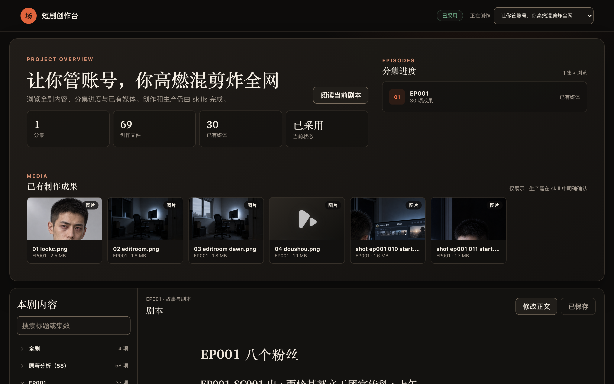

[中文](README.md) | **English**

# Drama Skills

[](https://github.com/zenstory-ai/drama-skills/actions/workflows/ci.yml)
[](https://github.com/zenstory-ai/drama-skills/releases/latest)
[](https://www.python.org/)
[](LICENSE)

An AI short-drama creation suite for screenwriters, motion-comic studios, and
directors. Ten skills take an idea or a long-form source all the way to episode
scripts, asset decisions, image prompts, storyboard keyframes, and video prompts —
carrying clear ownership and
continuity through the entire chain. Works with Claude Code, Codex, and other
runtimes that support Agent Skills.

For a new project, each episode defaults to five Markdown files: `剧本.md`,
`视觉设定.md`, `分镜.md`, `图片提示词.md`, and `视频提示词.md`.

## Where this came from

These skills come out of our own motion-comic studio's production line: over a
thousand AI short-drama and motion-comic projects since 2025, across several
generations of in-house and open-source tooling. Front end and back end together
reached nearly 80,000 lines, and stopped being maintainable at the pace models and
requirements were moving.

The answer turned out to be dropping the monolithic all-in-one GUI — distilling
the historical project workspaces and image/video prompts into this skill suite, and letting
producers maintain projects and write prompts directly through an agent CLI over
plain files, confirming the prompts before anything goes to generation. It works
noticeably better. What is left of the in-house tooling is the generation queue.

**Confirmation deliberately comes before production:** prompts land in files first.
The production skill shows the exact count, content, references, parameters, outputs,
and adapter; it executes only after the user sees and confirms that preview.
Credentials stay outside the project, and project files and the other skills remain
provider-neutral.

## Install

Needs **Python 3.9 or newer** (the version macOS ships is enough).
Just tell Claude Code, Codex, or any agent that can import a GitHub repository:

```
Install this skill suite: https://github.com/zenstory-ai/drama-skills
```

<details>
<summary>Manual linking (install all skills or only the ones you need)</summary>

```bash
git clone https://github.com/zenstory-ai/drama-skills.git && cd drama-skills

# Claude Code
mkdir -p "$HOME/.claude/skills"
for skill in skills/*; do
  ln -s "$PWD/$skill" "$HOME/.claude/skills/$(basename "$skill")"
done

# Codex
mkdir -p "${CODEX_HOME:-$HOME/.codex}/skills"
for skill in skills/*; do
  ln -s "$PWD/$skill" "${CODEX_HOME:-$HOME/.codex}/skills/$(basename "$skill")"
done
```

Each skill is an independent installation unit. For a single writing, review, or
production capability, link only that directory. `short-drama` provides project
initialization, routing, and the Dashboard; it is not an installation gate for the
other skills.

</details>

Invocation differs by runtime: Claude Code uses `/short-drama`, Codex uses
`$short-drama`, and you can always drop the prefix and just describe the task in
plain language. The two forms are interchangeable in the examples below.

## Quick start

```
# 0. With a source novel (optional): triage before committing to a full pass
Use $short-drama-novel-analyze to triage 输入/novel.txt and tell me whether it is worth adapting

# With a complete multi-episode script (optional): infer this file's boundaries,
# read one episode at a time, and resume the episode map from disk
Use $short-drama-develop to build the episode map from 输入/full-screenplay.txt without loading the whole season into context

# 1. New project
Use $short-drama to init a vertical 9:16 urban face-slapping short-drama project

# 2. Write episode 1
Use $short-drama-write to write EP001: a delivery rider humiliated at a luxury
hotel turns out to be the group chairman

# 3. Extract assets, write prompts and storyboards (these can be one request)
Use $short-drama-assets to extract characters/scenes/props from EP001
When the visual language needs alignment, optionally use $short-drama for Look Development
Use $short-drama-image-prompts to write reference prompts for accepted assets
Use $short-drama-storyboard to author EP001's storyboard and frozen keyframes
Use $short-drama-video-prompts to translate each authored shot into a video prompt
# When you name a target model and need people/places/props consistent across shots, say so about references too:
Use $short-drama-video-prompts to write EP001's video prompts for MiniMax H3; first look through the project for existing character, location and prop images plus this shot's start frame and bind them as references, list whatever is still missing, and do not fall back to text-to-video
# When you make the reference images yourself and they never enter the project, ask for the attach plan instead:
Use $short-drama-video-prompts to write EP001's video prompts for MiniMax H3; I attach the reference images myself, so tell me per shot which pictures to attach, in what order, and what each one governs

# 4. Produce after explicit confirmation
Use $short-drama-produce to preview EP001's accepted image, video, TTS, or timeline-music job; execute only after I confirm

# 5. Cut the generated material into a film
Use $short-drama-edit to cut EP001's produced shots into a film, stating the reason behind every in and out point

# 6. Review when needed
Use $short-drama-review to review EP001's script and prompts
```


Samples live in [examples/](examples/). The public creator-first sample is
[*Let You Run the Account*, EP001](examples/creator-first/EP001/). Other example
directories are repository-maintenance and validator-regression fixtures rather than
instructions for the current workflow.
To walk the ten skills as one comic-drama production line, with per-step commands,
outputs, and common pitfalls, see the
[comic-drama workflow guide](docs/comic-drama-workflow.md) (Chinese).

## The ten skills



```mermaid
flowchart LR
    classDef phase fill:#e8f4fd,color:#1a1a2e,stroke:#4a9be8,stroke-width:1px
    classDef final fill:#fce4ec,color:#333,stroke:#e57373,stroke-width:1px

    nva["Source analysis<br/>$short-drama-novel-analyze"]:::phase
    dev["Story development<br/>$short-drama-develop"]:::phase
    write["Episode script<br/>$short-drama-write"]:::phase
    assets["Asset decisions<br/>$short-drama-assets"]:::phase
    img["Image prompts<br/>$short-drama-image-prompts"]:::phase
    sb["Storyboard/keyframes<br/>$short-drama-storyboard"]:::phase
    vid["Video prompts<br/>$short-drama-video-prompts"]:::phase
    prod["Confirmed production<br/>$short-drama-produce"]:::phase
    cut["Editing<br/>$short-drama-edit"]:::phase
    rev["Review<br/>$short-drama-review"]:::final
    pkg["Text delivery package"]:::final

    nva -.with a source.-> dev
    dev -.optional.-> write --> assets
    assets --> img
    assets --> sb --> vid
    img --> prod
    vid --> prod
    prod --> cut --> rev --> pkg
```

| Skill | Responsibility |
|---|---|
| `short-drama` | Init, routing, visual direction/Look Development, and Dashboard |
| `short-drama-novel-analyze` | Sampled adaptation triage, chapter index, per-chapter function extraction, story units and rhythm, adaptation value, and episode candidates for a long source |
| `short-drama-develop` | Traceable adaptation, Agent-led indexing/slicing/resume for complete multi-episode scripts, story engine, episode map, director brief, genre & hook playbook |
| `short-drama-write` | Episode contract, causal beats, performable screenplay, and the project's accepted production dialect |
| `short-drama-assets` | Character/Look, Location/View, Prop/State, optional voice direction, continuity decisions |
| `short-drama-image-prompts` | Lookdev style frames, reusable character/location/prop reference prompts, and scoped edits |
| `short-drama-storyboard` | Optional scene visual plans and Coverage Auditions, source coverage, shots, boundaries, and frozen keyframes |
| `short-drama-video-prompts` | Ordered action, multi-actor performance and attention handoffs, camera/audio intent, timing, exact boundaries, and cross-shot timeline-music specs |
| `short-drama-produce` | Preview a bounded image/video/TTS/music job, require explicit confirmation, execute an external adapter, and record results; optional Seedance, GPT Image 2, MiniMax H3 video, and MiniMax Music profiles are included |
| `short-drama-edit` | Usable band per generated clip, in/out points and shot order, dialogue integrity, subtitles and loudness; written as a cut list and rendered into a film |
| `short-drama-review` | Structural/content review, project-bounded diagnosis from authorized production observations, and revision verdicts |


## Demo

The 24-second sample below is the far end of one complete run: a 20-chapter source through
analysis, screenplay, visual design, image prompts, a 21-shot storyboard and video prompts,
then eight generated clips for scene SC003, cut into a film against a cut list.

https://github.com/user-attachments/assets/0809876a-2a23-4723-a809-45c57988939f


## Local creator workspace

One line inside your agent (Codex writes `$short-drama dashboard`):

```
/short-drama dashboard
```

Runs on macOS, Linux, WSL, and native Windows. It serves with `--detach`, in its own process, so
the link stays valid for the whole session; `--status` reprints it and `--stop` shuts it down.

When everything is written, hand it over: `project_tool.py export <project> --out <dir outside the
project>` copies each episode's existing five Markdown documents and `制作成果/` into one delivery
directory with a manifest and checksums.


